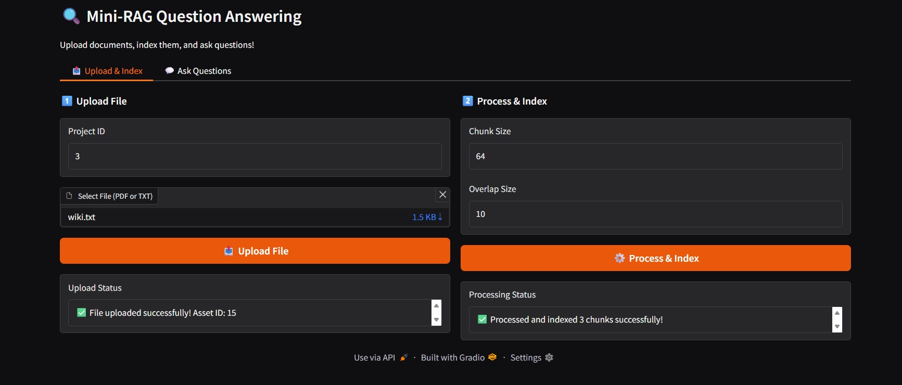
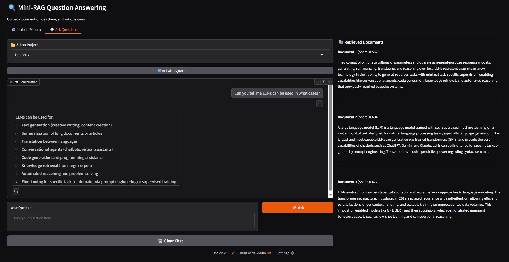

# Mini-RAG

A minimal implementation of a Retrieval-Augmented Generation (RAG) system for question answering, featuring a FastAPI backend and a Gradio UI.

## Features

- **RAG Pipeline**: Upload documents (PDF, TXT), process/chunk them, and index into a vector database.
- **Question Answering**: Ask questions about your documents using LLMs.
- **FastAPI Backend**: Robust API for file management, processing, and NLP tasks.
- **Gradio UI**: User-friendly interface for interacting with the system.
- **Docker Support**: Easy deployment using Docker Compose.
- **Asynchronous**: Built with `asyncio` for performance.

## Screenshots

<p align="center">
  
</p>

<p align="center">
  
</p>

## Requirements

- Python 3.10 or later
- Docker & Docker Compose (optional, for containerized run)

## Installation (Local)

1.  **Clone the repository:**

    ```bash
    git clone <repository-url>
    cd mini-rag
    ```

2.  **Create and activate a virtual environment (recommended):**

    ```bash
    # Using conda
    conda create -n mini-rag python=3.10
    conda activate mini-rag

    # OR using venv
    python -m venv venv
    # Windows
    .\venv\Scripts\activate
    # Linux/Mac
    source venv/bin/activate
    ```

3.  **Install dependencies:**
    ```bash
    pip install -r src/requirements.txt
    ```

## Configuration

1.  **Environment Variables:**
    Copy the example environment file to `.env`:

    ```bash
    cp src/.env.example src/.env
    # On Windows PowerShell:
    # Copy-Item src/.env.example -Destination src/.env
    ```

2.  **Edit `src/.env`:**
    Open `src/.env` and configure the following:
    - `OPENAI_API_KEY`: Your OpenAI API key (if using OpenAI).
    - `COHERE_API_KEY`: Your Cohere API key (if using Cohere for embeddings).
    - `POSTGRES_*`: Database credentials (default is usually fine for local dev if you have Postgres running).
    - `VECTOR_DB_BACKEND`: Choose between `PGVECTOR` or `QDRANT`.

## Running the Application

### Option 1: Using Docker (Recommended)

This will start the API, Database, Vector DB, and other services.

1.  **Navigate to the docker directory:**

    ```bash
    cd docker
    ```

2.  **Start services:**
    ```bash
    docker-compose up -d --build
    ```

### Option 2: Running Locally

Ensure you have a PostgreSQL database running and configured in your `.env`.

1.  **Navigate to the source directory:**

    ```bash
    cd src
    ```

2.  **Start the FastAPI Backend:**

    ```bash
    uvicorn main:app --reload --host 0.0.0.0 --port 5000
    ```

    The API will be available at `http://localhost:5000`.
    API Docs: `http://localhost:5000/docs`

3.  **Start the Gradio UI:**
    Open a new terminal, activate your environment, and run:
    ```bash
    python gradio_app.py
    ```
    The UI will be available at `http://localhost:7860`.

## Usage

1.  **Open the Gradio UI** (`http://localhost:7860`).
2.  **Upload & Index**:
    - Go to the "Upload & Index" tab.
    - Enter a Project ID (e.g., 1).
    - Upload a PDF or TXT file.
    - Click "Process & Index".
3.  **Ask Questions**:
    - Switch to the "Ask Questions" tab.
    - Select your Project ID.
    - Type your question and click "Ask".

## API Documentation

Once the server is running, you can explore the full API documentation at:

- Swagger UI: `http://localhost:5000/docs`
- ReDoc: `http://localhost:5000/redoc`
